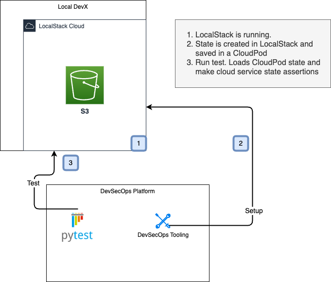

# basic-pod-integration-test
Basic LocalStack integration test using LocalStack Pods.
This is a basic example of how LocalStack CloudPods can be used to inject state into
your AWS services for integration testing.
You can find the test in [test_pod.py](./auto_tests/python/test_pod.py).



## Setup
1. From the working directory:
Set your LocalStack pro key. Add this line of code to a file named `.env-gdc-local` at the root of this project.
Set your actual LocalStack key.

```bash
export LOCALSTACK_API_KEY=<your key>
```

2. Setup an AWS_PROFILE for LocalStack

#### Add this to your `~/.aws/config` file

```text
[profile localstack]
region=us-east-1
output=json
endpoint_url = http://localhost:4566
```

#### Add this to your `~/.aws/credentials` file

```text
[localstack]
aws_access_key_id=test
aws_secret_access_key=test
```

## Run Python Integration Test

```shell
make test
```